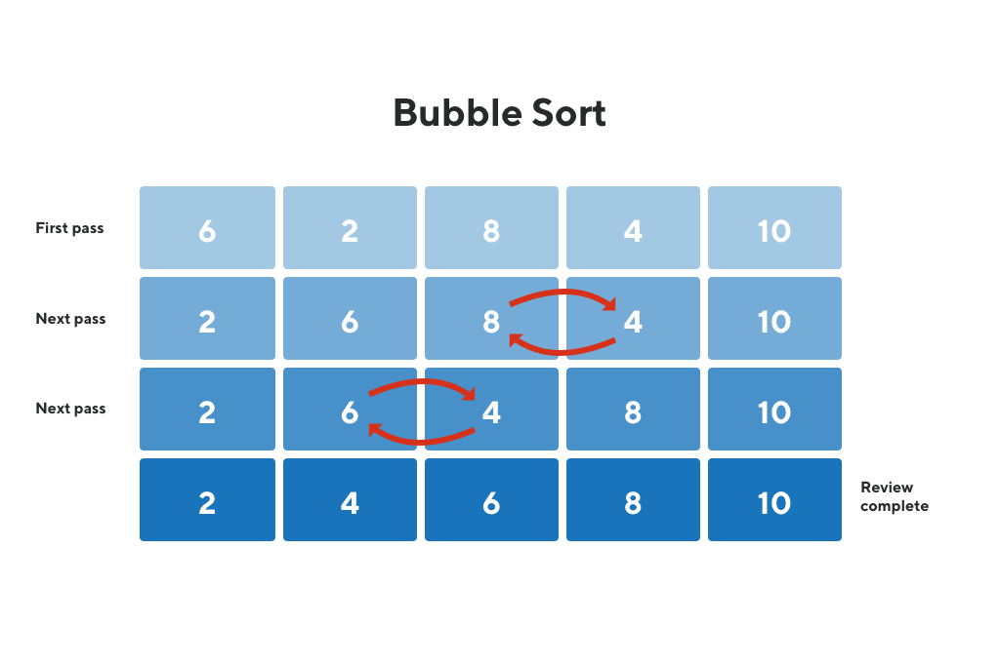

# bubble-sort

> The goal of the project was to create a version of bubble-sort to sort an array using blocks, functions and yield operator.

  

>Bubble Sort is an sorting algorithm that passes though an array, compares adjacent elementsand swaps them if neccesary.

  

## Live Demo

## Built With

- Ruby
- vscode
- Ruby Rubocop

## Authors

👤 **Alaukik**

- Github: [@newhorizon-tech](https://github.com/newhorizon-tech)
- Twitter: [@techintosh3](https://twitter.com/techintosh3)

👤 **Tahiry**

- Github: [@tahiry-dev](https://github.com/tahiry-dev)
- Twitter: [Tahiry Randriamiarintsoa](https://www.linkedin.com/in/tahiry-randriamiarintsoa-2276831b1/)

## 🤝 Contributing

Contributions, issues and feature requests are welcome!

Feel free to check the [issues page](https://github.com/tahiry-dev/bubble-sort/issues).

## Show your support

Give a ⭐️ if you like this project!
